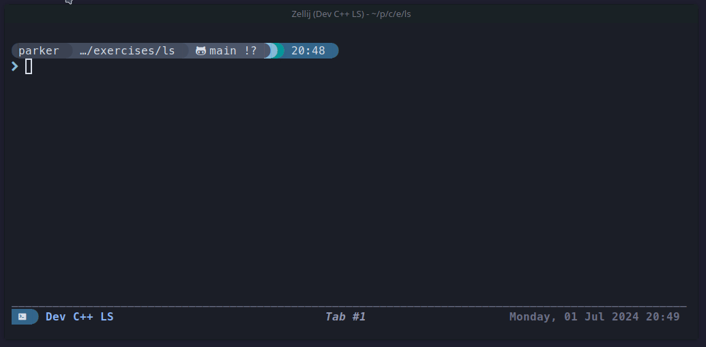

    <h1>C++ Experiments</h1>
    

      
      
    

    A collection of experimental C++ programs for the purpose of learning and personal exploration.
      
    <h3>Cellular Automata</h3>
    
    
    <h3>Pls</h3>
    
    

