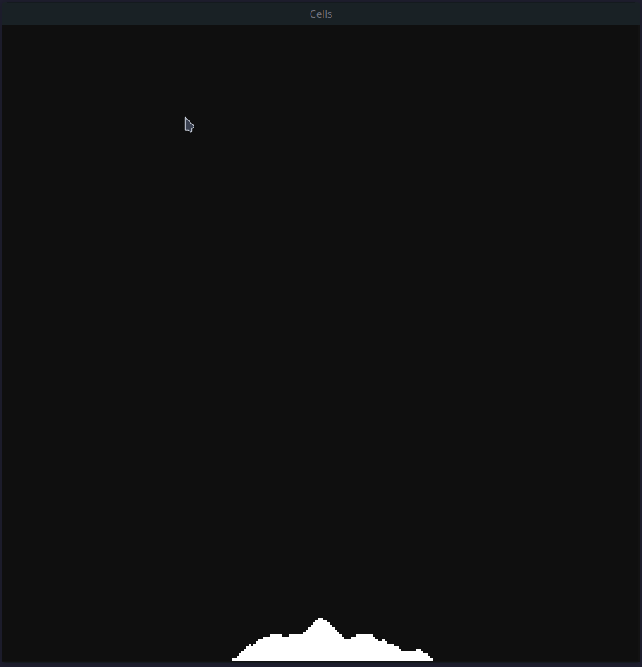
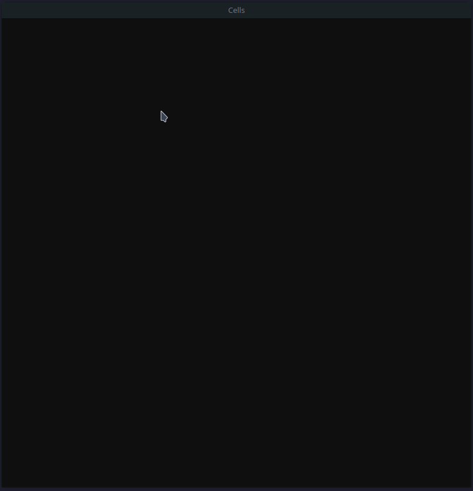
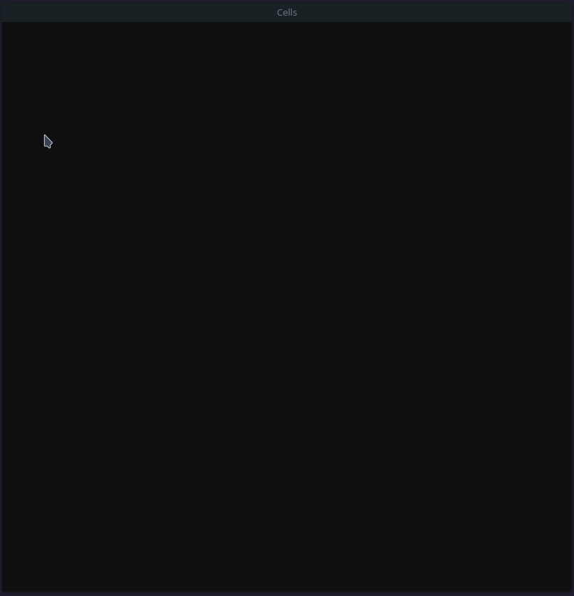

    <h1>Cellular Automata</h1>
    

      
      
    

 

I started this project with the intent to **explore cellular automata**.
While working my focus transitioned from modeling specific cell behavior to creating a structure to facilitate arbitrary cell behavior.  
The result is a **framework for manipulating and viewing cellular** interactions on a 2D grid. Specifically, a basic falling sand simulation.

> This is my first C++ project and is pretty barebones, but it provides a satisfactory starting off point for visualizing animated cells.

    
    

## Features

    
viewport navigation

    
    <ul><li>panning</li> <li>exponential zoom</li> <li>multi hotkey navigation</li></li></ul>

    
deleteting cells

                

clear canvas

    

    
polling interpolation

        
                    
<ul>
    <li>Compensates for low polling rate by interpolating between polling points with Bresenham's line algorithm</li>
    <li>Creates smooth lines during quick mouse movements</li>
</ul>

    
fast enough

    
    <ul>
      <li>vertex based rendering</li>
      <li>avg 2ms per frame when writing to a >200000 cell canvas</li>
    </ul>

