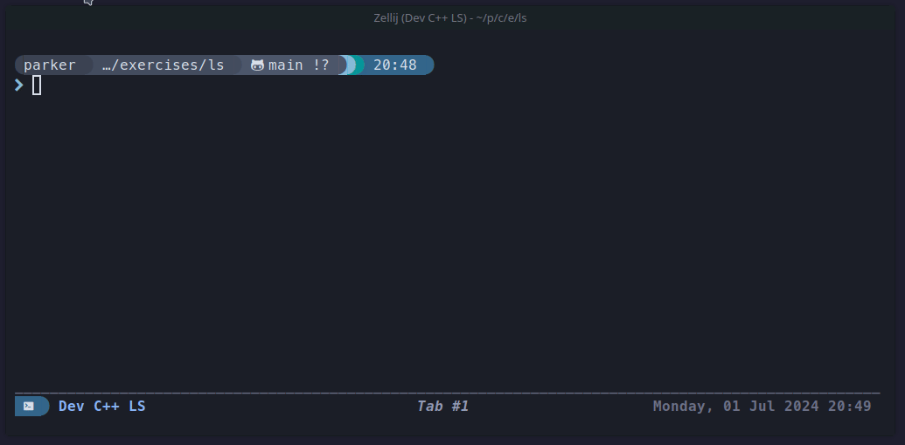

    <h1>pls command</h1>
    

      
    
 
    My own implementation of the <b>ls command</b>, using exclusively C++ standard libraries. 
    The name is a play on my first initial <b>p</b> and the unix <b>ls</b> command: <b>pls</b>
      
    

 

## Features
- Icons
  - Control based on file name or extension
- Colors
- Custom argument parser
- Custom config parser

## Screenshots

## Build Dependencies
- `Cmake`
- `Catch2` for tests
